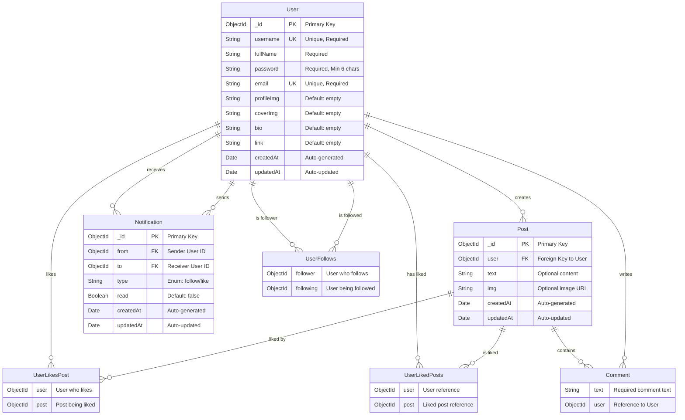

# Twitter Clone ER Diagram

## Entity Relationship Diagram

## Relationship Details

### 1. User → Post (1:N)
- **Cardinality**: One User can create many Posts
- **Constraint**: Each Post must have exactly one creator
- **Implementation**: Post.user field references User._id

### 2. User ↔ User (M:N) - Follow Relationship
- **Cardinality**: Many Users can follow many Users
- **Implementation**: 
  - User.followers[] array contains User IDs
  - User.following[] array contains User IDs

### 3. User ↔ Post (M:N) - Like Relationship
- **Cardinality**: Many Users can like many Posts
- **Implementation**:
  - Post.likes[] array contains User IDs
  - User.likedPosts[] array contains Post IDs

### 4. Post → Comment (1:N)
- **Cardinality**: One Post can have many Comments
- **Implementation**: Comments embedded as subdocuments in Post.comments[]

### 5. User → Comment (1:N)
- **Cardinality**: One User can write many Comments
- **Implementation**: Comment.user field references User._id

### 6. User → Notification (1:N) - Receiver
- **Cardinality**: One User can receive many Notifications
- **Implementation**: Notification.to field references User._id

### 7. User → Notification (1:N) - Sender
- **Cardinality**: One User can send many Notifications
- **Implementation**: Notification.from field references User._id

## Database Design Patterns

### 1. Embedded Documents
- **Comments**: Embedded in Post documents for better performance
- **Benefits**: Faster queries, atomic operations

### 2. Array References
- **Followers/Following**: Arrays of ObjectIds for efficient lookups
- **Likes**: Arrays of ObjectIds for quick like status checks

### 3. Junction Collections
- **Notifications**: Separate collection for complex querying
- **Benefits**: Indexed fields, flexible querying

## Constraints and Validations

### User Collection
- `username`: Unique, required
- `email`: Unique, required
- `password`: Required, minimum 6 characters
- `followers[]`: Array of valid User ObjectIds
- `following[]`: Array of valid User ObjectIds
- `likedPosts[]`: Array of valid Post ObjectIds

### Post Collection
- `user`: Required, must reference valid User
- `text` OR `img`: At least one must be present
- `likes[]`: Array of valid User ObjectIds
- `comments[]`: Array of comment subdocuments

### Notification Collection
- `from`: Required, must reference valid User
- `to`: Required, must reference valid User
- `type`: Must be either "follow" or "like"
- `read`: Boolean, defaults to false

## Index Strategy

1. **Primary Indexes**: `_id` (automatic)
2. **Unique Indexes**: `username`, `email`
3. **Foreign Key Indexes**: `Post.user`, `Notification.from`, `Notification.to`
4. **Text Index**: `Post.text` for search functionality
5. **Compound Indexes**: `Notification.to + read` for unread notifications 