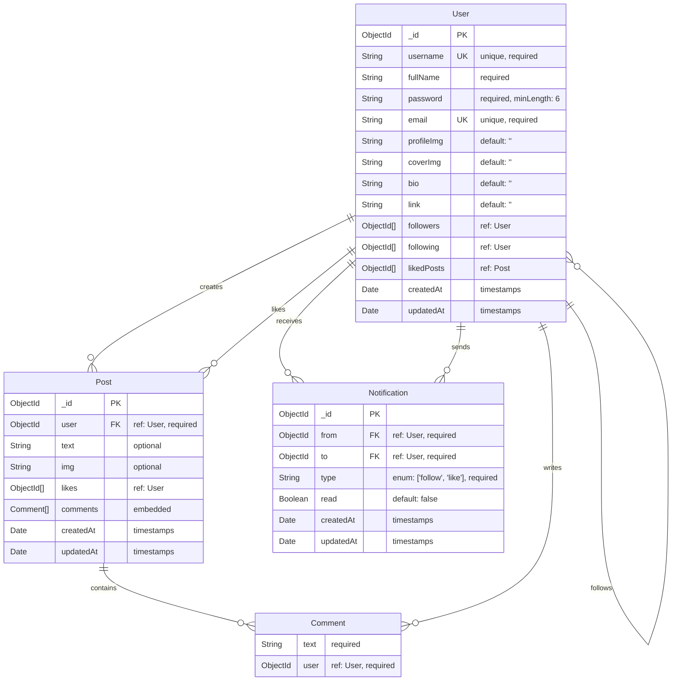

# Twitter Clone Database Schema Diagram

## Database Schema Overview



## Detailed Table Structures

### 1. User Collection
```javascript
{
  _id: ObjectId,
  username: String (unique, required),
  fullName: String (required),
  password: String (required, minLength: 6),
  email: String (unique, required),
  profileImg: String (default: ""),
  coverImg: String (default: ""),
  bio: String (default: ""),
  link: String (default: ""),
  followers: [ObjectId] (ref: User),
  following: [ObjectId] (ref: User),
  likedPosts: [ObjectId] (ref: Post),
  createdAt: Date,
  updatedAt: Date
}
```

### 2. Post Collection
```javascript
{
  _id: ObjectId,
  user: ObjectId (ref: User, required),
  text: String (optional),
  img: String (optional),
  likes: [ObjectId] (ref: User),
  comments: [
    {
      text: String (required),
      user: ObjectId (ref: User, required)
    }
  ],
  createdAt: Date,
  updatedAt: Date
}
```

### 3. Notification Collection
```javascript
{
  _id: ObjectId,
  from: ObjectId (ref: User, required),
  to: ObjectId (ref: User, required),
  type: String (enum: ["follow", "like"], required),
  read: Boolean (default: false),
  createdAt: Date,
  updatedAt: Date
}
```

## Key Relationships

1. **User-Post**: One-to-Many (User creates multiple Posts)
2. **User-User**: Many-to-Many (Users follow other Users)
3. **User-Post**: Many-to-Many (Users like Posts)
4. **Post-Comment**: One-to-Many (Post contains multiple Comments)
5. **User-Comment**: One-to-Many (User writes multiple Comments)
6. **User-Notification**: One-to-Many (User receives multiple Notifications)

## Indexes

- **Post Collection**: Text index on content for search functionality
- **User Collection**: Unique indexes on username and email
- **Notification Collection**: Indexes on from, to, and read fields for efficient queries

## Data Flow

1. **User Registration**: Creates new User document
2. **Post Creation**: Creates Post with user reference
3. **Follow Action**: Updates both users' followers/following arrays
4. **Like Action**: Updates post's likes array and user's likedPosts array
5. **Comment Action**: Adds comment to post's comments array
6. **Notification**: Creates notification for follow/like actions 