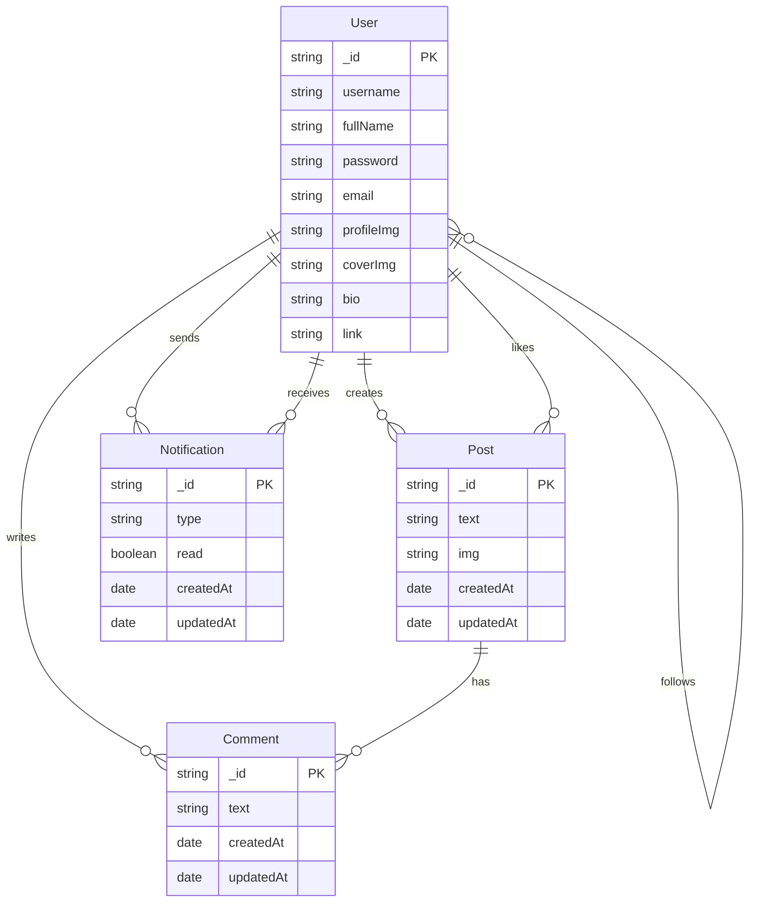

# Twitter Clone ER Diagram (Mermaid Style)

---

- **Rectangles**: Entities (User, Post, Comment, Notification)
- **Ovals**: Attributes (listed inside each entity)
- **Diamonds**: Relationships (labeled on connecting lines)
- **PK**: Primary Key

This diagram follows the style of your reference image, adapted for Mermaid syntax. 